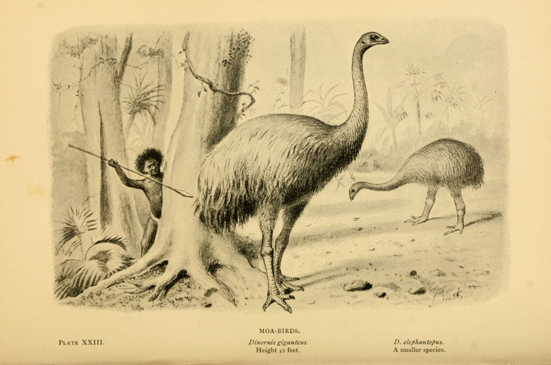

# Moag

Moag is a scaffold generator

[![gitter][gitter-image]][gitter-url]
[![NPM version][npm-image]][npm-url]




> "Lost, like the Moa is lost" - Maori proverb

## Features

- support express && koa

## Install

    [sudo] npm install -g moag
    
## Usage

### for koa 2 common function

```
moag student2 name:string password:string -k
```

### for koa2 async/await

```
moag cup name:string password:string -k -a
```

### for koa2 generator

```
moag book name:string password:string -k -g
```

### default for expresss

    ➜  moag git:(master) moag
    Moajs HELP:

    moag: 【创建脚手架】 moag user name:string password:string uid:object

    Have a good day! Moaer
    
### create scaffold user

    moag user name:string password:object
    
    
mongoose支持的data type基本如下：

- String -> string
- Number-> number
- Date -> date
- Boolean -> boolean
- Buffer -> buffer
- ObjectId -> object
- Mixed  -> mixed
- Array -> array

## Contributing

1. Fork it
2. Create your feature branch (`git checkout -b my-new-feature`)
3. Commit your changes (`git commit -am 'Add some feature'`)
4. Push to the branch (`git push origin my-new-feature`)
5. Create new Pull Request

## History


- v1.0.0 init


## Welcome fork and feedback

- write by `i5ting` shiren1118@126.com

如有建议或意见，请在issue提问或邮件

## License

this repo is released under the [MIT
License](http://www.opensource.org/licenses/MIT).


[npm-image]: https://img.shields.io/npm/v/moag.svg?style=flat-square
[npm-url]: https://npmjs.org/package/moag
[gitter-image]: https://badges.gitter.im/Join%20Chat.svg
[gitter-url]: https://gitter.im/i5ting/moag?utm_source=badge&utm_medium=badge&utm_campaign=pr-badge&utm_content=badge